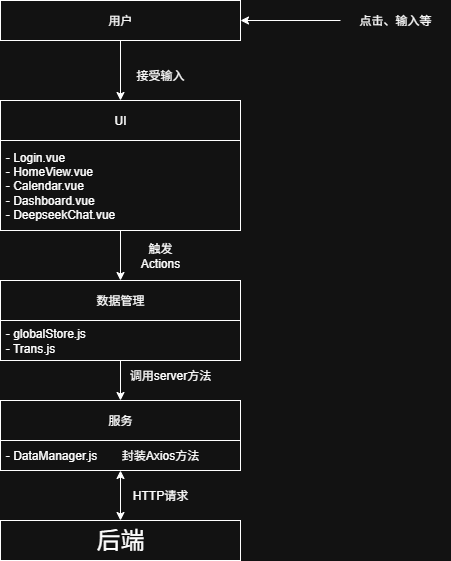

# 架构设计报告

## 1. 系统整体架构

Timer 使用前后端分离结构：

+ 后端负责管理日程库；构建大模型 AI Agent；为前端和桌宠提供接口，以获取日程信息或接收大模型对话并返回 response。

  ```mermaid
  graph TB
  	subgraph "/schedule"
  		A[后端]
  		B[前端]
  		C[桌宠]
  	end
  	
  	subgraph "/chat"
  		A1[后端]
  		B1[前端]
  		C1[桌宠]
  	end
  	
  	subgraph "/auth"
  		A2[后端]
  		B2[前端]
  		C2[桌宠]
  	end
  	
  	B -->|/schedule/*| A
      A -->|schedule_info| B
      C -->|requests| A
      A -->|schedule_info| C
  	
  	B1 -->|/chat - user_input| A1
      A1 -->|response| B1
      C1 -->|requests - user_input| A1
      A1 -->|response| C1
  	
  	B2 -->|/auth - user_info| A2
      A2 -->|user_id| B2
      C2 -->|requests - user_info| A2
      A2 -->|user_id| C2
  	
  ```

  + 业务逻辑层 (Business Logic Layer): 主要在 `backends` 应用中实现。`core` 目录下的模块（如 `scheduler.py`, `ai_scheduler.py`）封装了核心的业务规则。`routes` 目录则作为 API 网关，将 HTTP 请求路由到相应的业务逻辑。
  + 数据访问层 (Data Access Layer): 同样在 `backends` 中，目前通过直接读写 `data` 目录下的 `.json` 文件实现，用于存储用户信息、日程、聊天记录等。

+ 前端基于Vue.js 3开发，采用基于组件的架构模式。
  * 分层架构：
      * UI组建层：负责渲染UI、触发事件
      * 服务层：封装与后端API的通信。提供了可复用的API调用函数。
      * 数据管理层：管理用户数据，存储配置信息。
  * 架构图：
      * 

+ 桌宠使用 PyQt5 构建，通过 requests 库和后端接口进行交互

## 2. 关键设计决策

### 3.1 技术选型

| 组件 | 选型  |
| ---- | ----- |
| 后端 | Flask |
| 前端 | Vue3  |
| 桌宠 | PyQt5 |

#### 后端

+ **核心框架**：基于 Python Flask 的 API 服务器，负责处理业务逻辑、数据存储、用户认证和 AI 功能的集成
+ **技术栈**: Python 3, Flask, Flask-Session。
  -   **核心模块**:
      -   `routes/`: 定义了认证、日程、聊天等模块的 API 端点。
      -   `core/`: 实现了系统的核心业务逻辑。
          -   `scheduler.py`: 基础的日程管理逻辑。
          -   `ai_scheduler.py`: 集成 AI 能力的智能日程安排逻辑。
          -   `auth_manager.py`: 用户认证和会话管理。
      -   `config/`: 通过 `config.py` 和 `.yaml` 文件管理不同环境（开发、测试、生产）的配置。
      -   `data/`: 作为简易的数据库，使用 JSON 文件存储持久化数据。

#### 前端

* **核心框架**：`Vue.js 3`
        *   *理由*：便于学习上手，且生态丰富度高，Vue3 Composition API 的灵活性也很不错。
* **编程语言**：`JavaScript`
    *   *理由*：项目规模较小，且JavaScript较容易学习与使用，暂时无使用TypeScript的需求。
* **路由管理**：`Vue Router`
    *   *理由*：功能完善，与Vue3框架契合的很好。
* **UI组件库**：`Element Plus`
    *   *理由*：组件丰富，容易使用，展示效果美观。
* **HTTP客户端**：`Axios`
    *   *理由*：Axios功能强大，容易使用，且便于修改。
* **构建工具**：`Vite`
    *   *理由*：构建速度快，热更新体验好。
* **包管理器**：`npm`
    *   *理由*：便于使用，社区流行度高。

### 3.2 核心模块设计

#### 前端

* **组件设计原则**：
    *   **模块化设计**：以模块为单位进行开发，提高代码复用率。
    *   **关注点分离**：各组件专注于单一功能，避免臃肿。
* **API交互设计**：
    *   **高度封装**：单独的组件封装了与后端API交互的功能，便于前端使用，且在后端发生变动时，可以很方便的修改。
    *   **错误处理**：在Axios拦截器中处理全局错误提示，便于调试。
* **路由设计**：
    *   **路由结构**：本项目规模较小，仅使用单一的路由实现各个页面之间的跳转。
    *   **路由元信息**：通过路由附带`meta`字段进行访问权限管理。
    *   **路由守卫**：通过查询`Cache`判断登录状态，防止未登录用户访问登录以外的界面。
* **项目结构与组织**：
    * `/assets`：图标、CSS等。
    * `/components`：可复用组件，如展示卡片等。
    * `/router`：路由。
    * `/utils`：资源管理工具等。

#### 3.3 前后端接口定义

* **通信协议**：HTTP
* **认证机制**：初定为Session Cookie，但由于技术原因，暂时只能在http请求的params中附带相关信息。
    * **接口规范**
* **请求**
    * 日程管理：GET、POST、DELETE、PUT
    * 对话管理：GET、POST
* **响应**
    * 日程、对话管理分别有统一的响应数据结构。
    * 暂未实现HTTP状态码处理。
    * **关键接口示例**
* `GET /schedule`：获取日程列表
* `DELETE /schedule/<id>`：删除相应日程
* `POST /auth/register`：用户注册