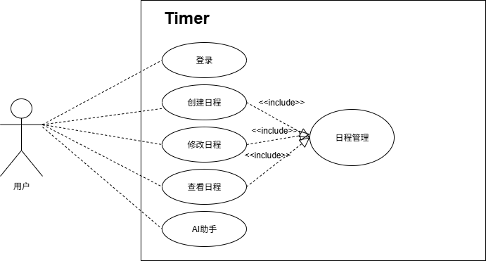
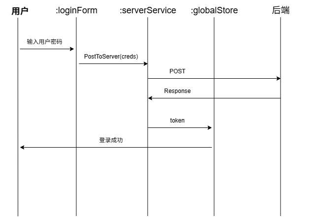
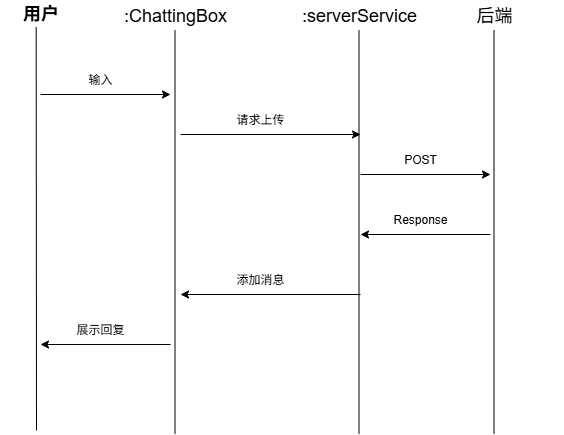

# 系统建模报告

## 前端

1. **引言**
    * 本文档旨在使用UML等建模方法描述**Timer**前端系统的结构、行为和交互。
    * 涵盖所有前端用户界面、用户交互逻辑、状态管理、API调用逻辑。**不涵盖**后端内部逻辑。
    * 使用`draw.io`绘制。
2. **用例图**
    * 
3. **类图**
    * 
4. **序列图**
    * 登录流程图：
    * 
    * 修改日程流程图：
    * 
    * AI对话流程图：
    * 

## 桌宠

### 1. 系统概述

桌宠系统是一个基于PyQt5的桌面宠物应用程序，具有智能交互、动画播放、心情管理、日程管理等功能。系统采用模块化设计，使用单例模式管理日程数据，支持多种交互方式和动画效果。

### 2. 用例图

```mermaid
graph TB
    User((用户))
    
    subgraph "桌宠系统"
        UC1[启动桌宠]
        UC2[与桌宠交互]
        UC3[管理日程]
        UC4[聊天功能]
        UC5[退出系统]
    end
    
    subgraph "交互方式"
        UC2_1[单击显示消息]
        UC2_2[双击拖拽]
        UC2_3[右键菜单]
        UC2_4[悬停显示气泡]
    end
    
    subgraph "菜单功能"
        UC3_1[刷新桌宠状态]
        UC3_2[关联日程账号]
        UC3_3[打开聊天窗口]
        UC3_4[退出程序]
    end
    
    User --> UC1
    User --> UC2
    User --> UC3
    User --> UC4
    User --> UC5
    
    UC2 --> UC2_1
    UC2 --> UC2_2
    UC2 --> UC2_3
    UC2 --> UC2_4
    
    UC2_3 --> UC3_1
    UC2_3 --> UC3_2
    UC2_3 --> UC3_3
    UC2_3 --> UC3_4
```

#### 主要用例说明

1. **启动桌宠**：用户启动应用程序，桌宠显示在桌面上
2. **与桌宠交互**：用户通过鼠标与桌宠进行各种交互
3. **管理日程**：系统自动获取用户日程，桌宠根据日程调整心情
4. **聊天功能**：用户可以与桌宠进行文字聊天
5. **退出系统**：用户退出程序，桌宠播放退出动画

### 3. 类图

```mermaid
classDiagram
    class PetConfig {
        +BASE_URL: str
        +SCHEDULE_REMINDER_DAYS: int
        +ANIMATION_FRAME_INTERVAL: int
        +IDLE_ACTION_INTERVAL: int
        +DEFAULT_PET_WIDTH: int
        +DEFAULT_PET_HEIGHT: int
        +get_animation_path(pet_id, animation_type, mood): str
        +get_idle_action_interval(): int
        +set_idle_action_interval(interval): void
    }
    
    class AnimationType {
        +STAND: str
        +DRAG: str
        +CHAT: str
        +STUDY: str
        +WALK: str
        +SWITCH_UP: str
        +SWITCH_DOWN: str
        +FINISH_WORK: str
        +SHUTDOWN: str
        +HUNGER: str
        +THINK: str
    }
    
    class MoodType {
        +HAPPY: str
        +NORMAL: str
        +POOR_CONDITION: str
    }
    
    class IdleActionType {
        +FINISH_WORK: str
        +THINK: str
        +HUNGER: str
        +STUDY: str
        +WALK: str
        +get_all_idle_actions(): List[str]
    }
    
    class DesktopPet {
        -id: int
        -position: Tuple[int, int]
        -mood: Mood
        -actions: List[str]
        -current_action: str
        -is_dragging: bool
        -is_chatting: bool
        -is_exiting: bool
        -is_performing_idle_action: bool
        -stats: Dict[str, Any]
        +get_id(): int
        +get_position(): Tuple[int, int]
        +get_mood_type(): str
        +perform_action(action): str
        +set_dragging_state(is_dragging): void
        +set_chatting_state(is_chatting): void
        +set_exiting_state(is_exiting): void
        +get_current_animation_path(): str
        +get_stats(): Dict[str, Any]
    }
    
    class Mood {
        -mood_type: str
        -schedule_count: int
        +getMoodType(): str
        +updateMood(schedule_count): void
        +calculateMoodType(schedule_count): str
    }
    
    class ScheduleManager {
        -schedules: List[Dict]
        -last_update_time: int
        -update_interval: int
        -count: int
        -summary: List[str]
        -_initialized: bool
        +update_schedules(): void
        +get_schedules(): List[Dict]
        +get_schedule_count(): int
        +get_active_schedules(): List[Dict]
        +get_upcoming_schedules_summary(): List[str]
        +get_upcoming_schedules_summary_count(): int
    }
    
    class DesktopPetUI {
        -controller: DesktopPetController
        -frames: List[str]
        -current_frame_index: int
        -bubble: QLabel
        -is_hovering: bool
        -is_exit_animation: bool
        +show_context_menu(position): void
        +show_bubble_message(message, mood_type): void
        +start_exit_animation(exit_callback): void
        +_handle_refresh_action(): void
        +_handle_chat_action(): void
        +_handle_account_action(): void
        +_handle_exit_action(): void
    }
    
    class DesktopPetController {
        -pet: DesktopPet
        -ui: DesktopPetUI
        -mouse_handler: MouseEventHandler
        -action_controller: PetActionController
        -idle_action_timer: QTimer
        +start_chat(): void
        +start_exit(): void
        +update_pet_mood(): void
        +_handle_idle_action(): void
        +_get_idle_action_message(action_type): str
    }
    
    class MouseEventHandler {
        -controller: DesktopPetController
        -is_dragging: bool
        -drag_start_pos: QPoint
        +mousePressEvent(event): void
        +mouseMoveEvent(event): void
        +mouseReleaseEvent(event): void
        +mouseDoubleClickEvent(event): void
    }
    
    class PetActionController {
        -pet: DesktopPet
        +perform_action(action_type): void
        +get_available_actions(): List[str]
    }
    
    class PetChatWindow {
        -pet_controller: DesktopPetController
        -chat_history: List[Dict]
        +send_message(message): void
        +receive_message(message): void
    }
    
    class LoginWindow {
        -session_id: str
        +login(username, password): bool
        +get_session_id(): str
    }
    
    PetConfig --> AnimationType
    PetConfig --> MoodType
    PetConfig --> IdleActionType
    
    DesktopPet --> Mood
    DesktopPet --> PetConfig
    
    DesktopPetUI --> DesktopPetController
    DesktopPetUI --> PetConfig
    
    DesktopPetController --> DesktopPet
    DesktopPetController --> DesktopPetUI
    DesktopPetController --> MouseEventHandler
    DesktopPetController --> PetActionController
    DesktopPetController --> ScheduleManager
    
    MouseEventHandler --> DesktopPetController
    
    PetActionController --> DesktopPet
    
    PetChatWindow --> DesktopPetController
    
    LoginWindow --> ScheduleManager
```

### 4. 序列图

#### 4.1 启动桌宠序列图

```mermaid
sequenceDiagram
    participant User as 用户
    participant Main as main.py
    participant Controller as DesktopPetController
    participant Pet as DesktopPet
    participant UI as DesktopPetUI
    participant Config as PetConfig
    
    User->>Main: 启动程序
    Main->>Config: 加载配置
    Main->>Pet: 创建桌宠实例
    Main->>UI: 创建UI界面
    Main->>Controller: 创建控制器
    Controller->>Pet: 设置桌宠
    Controller->>UI: 设置UI
    Controller->>UI: 显示桌宠
    UI->>User: 桌宠显示在桌面
```

#### 4.2 刷新桌宠状态序列图

```mermaid
sequenceDiagram
    participant User as 用户
    participant UI as DesktopPetUI
    participant ScheduleManager as ScheduleManager
    participant Backend as 后端API
    participant Controller as DesktopPetController
    participant Pet as DesktopPet
    
    User->>UI: 右键点击桌宠
    UI->>UI: 显示右键菜单
    User->>UI: 选择"刷新桌宠状态"
    UI->>ScheduleManager: 创建单例实例
    ScheduleManager->>ScheduleManager: 检查是否已初始化
    ScheduleManager->>ScheduleManager: update_schedules()
    ScheduleManager->>Backend: 获取日程数据
    Backend->>ScheduleManager: 返回日程信息
    ScheduleManager->>ScheduleManager: 更新内部状态
    ScheduleManager->>UI: 返回更新结果
    UI->>Controller: 通知状态更新
    Controller->>Pet: 更新桌宠心情
    Pet->>UI: 更新显示状态
    UI->>User: 显示更新完成消息
```

#### 4.3 退出桌宠序列图

```mermaid
sequenceDiagram
    participant User as 用户
    participant UI as DesktopPetUI
    participant Controller as DesktopPetController
    participant Pet as DesktopPet
    participant Config as PetConfig
    
    User->>UI: 右键选择"退出"
    UI->>Controller: _handle_exit_action()
    Controller->>Pet: set_exiting_state(True)
    Controller->>UI: start_exit_animation()
    UI->>UI: 播放退出动画
    UI->>Config: 获取退出动画路径
    Config->>UI: 返回动画路径
    UI->>UI: 播放动画帧
    UI->>UI: 动画播放完成
    UI->>UI: _finish_exit_animation()
    UI->>UI: 延迟500ms后退出
    UI->>User: 程序退出
```

### 5. 状态图

#### 5.1 桌宠状态图

```mermaid
stateDiagram-v2
    [*] --> 待机状态
    
    待机状态 --> 拖拽状态 : 双击
    拖拽状态 --> 待机状态 : 释放鼠标
    
    待机状态 --> 聊天状态 : 右键菜单选择聊天
    聊天状态 --> 待机状态 : 关闭聊天窗口
    
    待机状态 --> 待机动作状态 : 定时触发
    待机动作状态 --> 待机状态 : 动作完成
    
    待机状态 --> 退出状态 : 右键菜单选择退出
    拖拽状态 --> 退出状态 : 右键菜单选择退出
    聊天状态 --> 退出状态 : 右键菜单选择退出
    待机动作状态 --> 退出状态 : 右键菜单选择退出
    
    退出状态 --> [*] : 退出动画完成
```

#### 5.2 心情状态图

```mermaid
stateDiagram-v2
    [*] --> Happy
    
    Happy --> Normal : 日程数量增加
    Normal --> Happy : 日程数量减少
    Normal --> PoorCondition : 日程数量大幅增加
    PoorCondition --> Normal : 日程数量减少
    PoorCondition --> Happy : 日程数量大幅减少
    
    Happy --> Happy : 无日程变化
    Normal --> Normal : 无日程变化
    PoorCondition --> PoorCondition : 无日程变化
```

#### 5.3 ScheduleManager单例状态图

```mermaid
stateDiagram-v2
    [*] --> 未初始化
    
    未初始化 --> 已初始化 : 第一次调用__init__
    已初始化 --> 已初始化 : 后续调用__init__(直接返回)
    
    已初始化 --> 更新中 : update_schedules()
    更新中 --> 已初始化 : 更新完成
    更新中 --> 已初始化 : 更新失败
    
    已初始化 --> [*] : 程序退出
```

### 6. 系统架构特点

#### 6.1 设计模式应用

1. **单例模式**：ScheduleManager采用单例模式，确保全局唯一实例
2. **MVC模式**：Model(DesktopPet) - View(DesktopPetUI) - Controller(DesktopPetController)
3. **观察者模式**：UI组件观察桌宠状态变化并更新显示

#### 6.2 模块化设计

- **配置管理**：PetConfig统一管理所有配置
- **数据模型**：DesktopPet管理核心数据
- **UI层**：DesktopPetUI处理界面显示
- **控制层**：DesktopPetController协调各模块
- **工具类**：ScheduleManager、Mood等提供特定功能

#### 6.3 扩展性设计

- 支持添加新的动画类型
- 支持添加新的心情状态
- 支持添加新的交互方式
- 支持添加新的待机动作

### 7. 总结

桌宠系统采用现代化的软件架构设计，具有良好的模块化、可扩展性和可维护性。通过单例模式优化了资源管理，通过MVC模式实现了清晰的职责分离，通过状态图管理确保了系统状态的正确性。系统支持丰富的交互方式和动画效果，为用户提供了良好的使用体验。 

## 后端

```mermaid
graph TB
    %% ===== 参与者 =====
    User(("👤 用户"))
    style User fill:#f5f5f5,stroke:#333,stroke-width:2px

    %% ===== 功能模块 =====
    IntentAnalyzer{意图分析}
    ResponseGenerator(["响应生成"])

    subgraph "日程管理"
        B1[["创建日程"]]
        B2[["修改日程"]]
        B3[["删除日程"]]
        B4[["查询日程"]]
    end

    Dialog["通用对话"]

    %% ===== 交互逻辑 =====
    User -->|自然语言输入| IntentAnalyzer
    IntentAnalyzer -->|创建指令| B1
    IntentAnalyzer -->|修改指令| B2
    IntentAnalyzer -->|删除指令| B3
    IntentAnalyzer -->|查询指令| B4
    IntentAnalyzer -->|闲聊指令| Dialog

    B1 --> ResponseGenerator
    B2 --> ResponseGenerator
    B3 --> ResponseGenerator
    B4 --> ResponseGenerator
    Dialog --> ResponseGenerator

    ResponseGenerator -->|结构化输出| User

    %% ===== 样式优化 =====
    classDef user fill:#e3f2fd,stroke:#2196f3
    classDef intent diamond,fill:#bbdefb,stroke:#0d47a1
    classDef schedule fill:#c8e6c9,stroke:#2e7d32
    classDef dialog fill:#ffecb3,stroke:#ffa000
    classDef response fill:#fce4ec,stroke:#e91e63

    class User user
    class IntentAnalyzer intent
    class B1,B2,B3,B4 schedule
    class Dialog dialog
    class ResponseGenerator response

    linkStyle 0 stroke:#666,stroke-width:2px
    linkStyle 1,2,3,4,5 stroke:#1976d2,stroke-width:1.5px
    linkStyle 6,7,8,9,10 stroke:#4caf50,stroke-width:1.5px
    linkStyle 11 stroke:#ff9800,stroke-width:2px
```

类图

```mermaid
classDiagram
    class Database {
        +connect()
        +disconnect()
        +read()
        +write()
    }
    
    class ScheduleManager {
        +createSchedule()
        +updateSchedule()
        +deleteSchedule()
        +querySchedule()
        +syncSchedule()
        +remindSchedule()
    }
    
    class Scheduler {
        -scheduleManager: ScheduleManager
        +init()
        +createSchedule()
        +updateSchedule()
        +deleteSchedule()
        +querySchedule()
    }
    
    class AIScheduler {
        -promptGenerator: PromptGenerator
        -aiScheduleManager: AIScheduleManager
        +analyzeIntent()
        +generateResponse()
        +processAIChat()
    }
    
    class PromptGenerator {
        +generateSemanticPrompt()
        +generateCreationPrompt()
        +generateModificationPrompt()
        +generateQueryPrompt()
    }
    
    class AIScheduleManager {
        +analyzeUserInput()
        +generateScheduleData()
        +processDialogue()
    }
    
    Database <|-- ScheduleManager
    Scheduler  --  ScheduleManager : contains
    Scheduler <|-- AIScheduler
    AIScheduler  --  PromptGenerator : contains
    AIScheduler  --  AIScheduleManager : contains
```

创建日程序列图

```mermaid
sequenceDiagram
    participant User
    participant AIScheduler
    participant PromptGenerator
    participant AIScheduleManager
    participant Scheduler
    participant ScheduleManager
    
    User->>AIScheduler: 创建日程请求
    AIScheduler->>PromptGenerator: 生成语义分析提示词
    AIScheduler->>AIScheduleManager: 语义分析(创建意图)
    AIScheduler->>PromptGenerator: 生成创建专用提示词
    AIScheduler->>AIScheduleManager: 处理创建响应
    AIScheduler->>Scheduler: create_schedule(日程数据)
    Scheduler->>ScheduleManager: 创建日程
    ScheduleManager->>Database: 写入数据库
    ScheduleManager-->>Scheduler: 返回日程ID
    Scheduler-->>AIScheduler: 返回创建结果
    AIScheduler-->>User: 返回创建成功
```

修改日程序列图

```mermaid
sequenceDiagram
    participant User
    participant AIScheduler
    participant PromptGenerator
    participant AIScheduleManager
    participant Scheduler
    participant ScheduleManager
    participant Database
    
    User->>AIScheduler: 修改日程请求(日程ID+新内容)
    AIScheduler->>PromptGenerator: 生成修改意图分析提示词
    AIScheduler->>AIScheduleManager: 分析修改意图
    AIScheduler->>PromptGenerator: 生成修改内容提取提示词
    AIScheduler->>AIScheduleManager: 提取修改字段
    AIScheduler->>Scheduler: update_schedule(日程ID,修改内容)
    Scheduler->>ScheduleManager: 执行修改
    ScheduleManager->>Database: 查询原日程
    Database-->>ScheduleManager: 返回原日程数据
    ScheduleManager->>Database: 更新日程数据
    Database-->>ScheduleManager: 返回更新结果
    ScheduleManager-->>Scheduler: 返回修改结果
    Scheduler-->>AIScheduler: 返回处理结果
    AIScheduler->>PromptGenerator: 生成修改成功回复提示词
    AIScheduler->>AIScheduleManager: 生成用户友好回复
    AIScheduler-->>User: 返回修改成功消息
```

删除日程序列图

```mermaid
sequenceDiagram
    participant User
    participant AIScheduler
    participant PromptGenerator
    participant AIScheduleManager
    participant Scheduler
    participant ScheduleManager
    participant Database
    
    User->>AIScheduler: 删除日程请求(日程ID)
    AIScheduler->>PromptGenerator: 生成删除意图分析提示词
    AIScheduler->>AIScheduleManager: 分析删除意图
    AIScheduler->>PromptGenerator: 生成确认提示词
    AIScheduler->>AIScheduleManager: 生成确认话术
    User->>AIScheduler: 确认删除
    AIScheduler->>Scheduler: delete_schedule(日程ID)
    Scheduler->>ScheduleManager: 执行删除
    ScheduleManager->>Database: 查询日程存在
    Database-->>ScheduleManager: 返回日程数据
    ScheduleManager->>Database: 标记日程为已删除
    Database-->>ScheduleManager: 返回删除结果
    ScheduleManager-->>Scheduler: 返回删除结果
    Scheduler-->>AIScheduler: 返回处理结果
    AIScheduler->>PromptGenerator: 生成删除成功回复提示词
    AIScheduler->>AIScheduleManager: 生成用户友好回复
    AIScheduler-->>User: 返回删除成功消息
```

查询日程序列图

```mermaid
sequenceDiagram
    participant User
    participant AIScheduler
    participant PromptGenerator
    participant AIScheduleManager
    participant Scheduler
    participant ScheduleManager
    participant Database
    
    User->>AIScheduler: 查询日程请求(查询条件)
    AIScheduler->>PromptGenerator: 生成查询意图分析提示词
    AIScheduler->>AIScheduleManager: 分析查询意图
    AIScheduler->>PromptGenerator: 生成查询条件提取提示词
    AIScheduler->>AIScheduleManager: 解析查询条件
    AIScheduler->>Scheduler: query_schedule(解析后条件)
    Scheduler->>ScheduleManager: 执行查询
    ScheduleManager->>Database: 构建查询语句
    Database-->>ScheduleManager: 返回查询结果
    ScheduleManager-->>Scheduler: 返回日程列表
    Scheduler-->>AIScheduler: 返回原始查询结果
    AIScheduler->>PromptGenerator: 生成结果格式化提示词
    AIScheduler->>AIScheduleManager: 格式化查询结果
    AIScheduler-->>User: 返回格式化查询结果
```

通用对话序列图

```mermaid
sequenceDiagram
    participant User
    participant AIScheduler
    participant PromptGenerator
    participant AIScheduleManager
    
    User->>AIScheduler: 通用对话请求(内容)
    AIScheduler->>PromptGenerator: 生成对话意图分析提示词
    AIScheduler->>AIScheduleManager: 分析对话意图
 
    AIScheduler->>PromptGenerator: 生成通用回复提示词
    AIScheduler->>AIScheduleManager: 生成通用回复
    
    AIScheduler-->>User: 返回对话回复
```

```mermaid
stateDiagram-v2
    state "日程状态" as main {
        未创建 --> 已创建: 📅 创建日程
        
        state 活跃状态 {
            已创建 --> 已修改: ✏ 修改内容
            已修改 --> 已创建: 🔙 放弃修改
        }
        
        活跃状态 --> 已删除: 🗑 删除日程
        活跃状态 --> 已归档: 📦 归档日程
        已归档 --> 已删除: 🗑 删除日程
    }
    已删除 --> [*]: ✅ 完成清理

```

